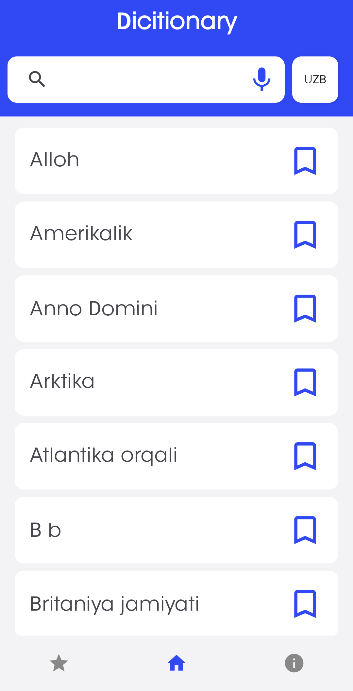
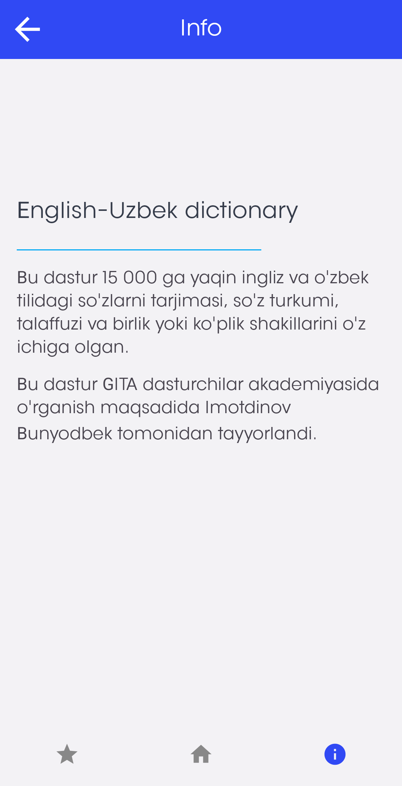
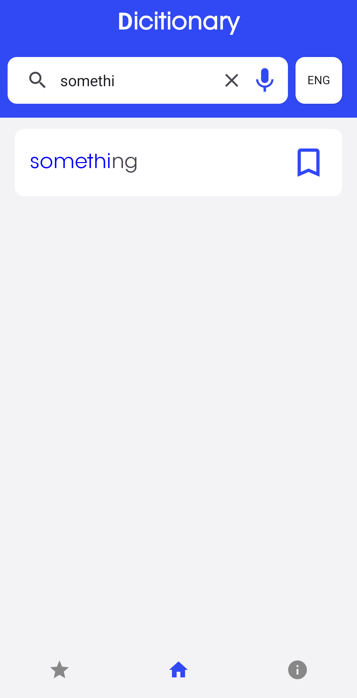
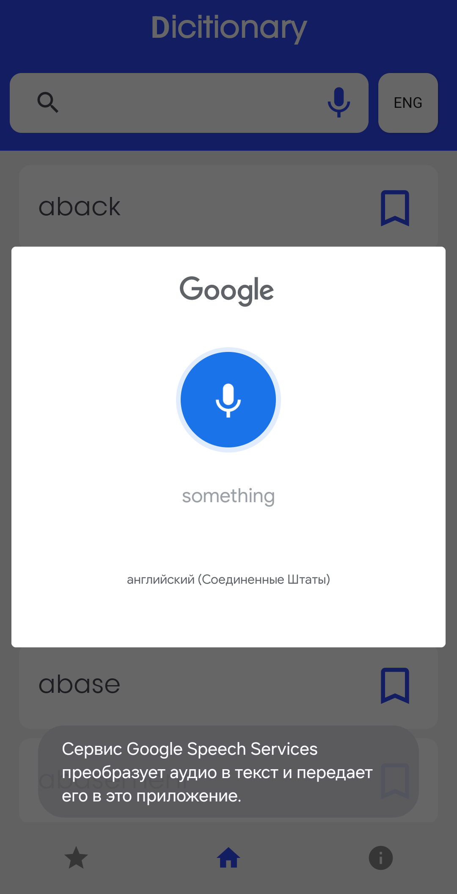

# Dictionary
# English-Uzbek Dictionary

English-Uzbek Dictionary is an Android application designed to help users translate words between English and Uzbek efficiently. It also provides speech-related functionalities for better learning.

## 📌 Features

- 📖 **English-Uzbek Word Translation**
- 🔊 **Text to Speech** (Listen to word pronunciation)
- 🎙 **Speech to Text** (Convert spoken words to text)
- 📂 **Offline Database** (Uses Room for data storage)
- 🔍 **Efficient Word Lookup** (Implemented using Cursor Adapter)

## 🛠 Technologies

- 📌 **Fragment with Navigation Component**
- 💾 **Room Database**
- 🔊 **Text to Speech (TTS)**
- 🎙 **Speech to Text (STT)**
- 📑 **Cursor Adapter**

## 📸 Screenshots

<table>
  <tr>
    <td></td>
    <td></td>
    <td></td>
  </tr>
  <tr>
    <td></td>
    <td></td>
  </tr>
</table>

## 🚀 Running the Project

Download the APK and try it out.

---

**Author:** [Imotdinov Bunyodbek]\
**Contact:** [imotdinovbunyodbek2@gmail.com]
